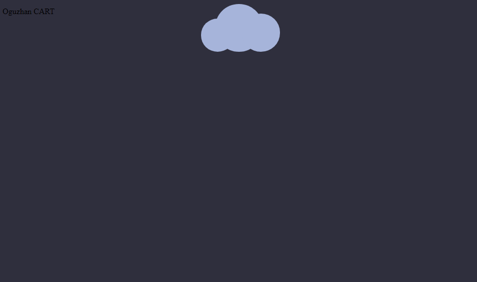

# Moving-cloud
 It is a mobile cloud application that contains only css.   Simple animated cloud application that will add color to your application.


## An animated application made with jquery using simple css and js.

## Inspired by a cloud application made. Similar but mobile and shaped app.
## Usage

```js
 var cloudWidth = $(".cloud").width();
    function cloudHeight() {
      $(".cloud").css({ 'height': cloudWidth + 'px' });
    };
    $(document).ready(function () {
      cloudHeight();
    });
    $(window).resize(function () {
      cloudWidth = $(".cloud").width();
      cloudHeight();
    });
```





## Live View
[Click to Live View](https://codepen.io/oguzhan1881/pen/BaQgbzo)


## Download
[Click to download](https://codepen-api-export-production.s3.us-west-2.amazonaws.com/zip/PEN/BaQgbzo/1616162535498/CodePen_Export_BaQgbzo.zip)

## Email address for your problems
oguzhancart1@gmail.com
